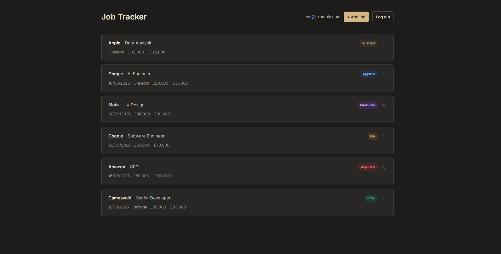

# Job Tracker

A full-stack web app to track job applications, statuses, and notes throughout the hiring process.

**Live demo**: https://job-tracker-fahim.vercel.app



---

## Stack

| Layer | Technology |
|-------|-----------|
| Frontend | React 19, React Router, Vite |
| Backend | Node.js, Express 5 |
| Database | PostgreSQL (Neon) |
| Auth | JWT + bcrypt |
| Hosting | Vercel (frontend), Render (backend) |

---

## Technical decisions

**JWT over sessions** — the frontend and backend are deployed separately (Vercel + Render). JWTs are stateless so the API doesn't need to share session state across servers. Tokens are stored in localStorage and sent as `Authorization: Bearer` headers on every request.

**Parameterised queries throughout** — all SQL uses `$1, $2` placeholders rather than string interpolation. This prevents SQL injection at the database driver level rather than relying on input sanitisation.

**IDOR prevention** — every query that reads or writes a job includes `AND user_id = $n`. Without this, a logged-in user could access any record by guessing its ID. The check happens in SQL so there's no risk of accidentally skipping it in application logic.

**Uniform auth error messages** — both "email not found" and "wrong password" return the same `Invalid credentials` response. Different messages would let an attacker enumerate which emails are registered.

**Vite proxy in dev, Vercel rewrites in prod** — in development, Vite forwards `/api/*` to the Express server. In production, a `vercel.json` rewrite does the same to the Render URL. Components always call `/api/...` with no environment-specific logic.

---

## What I'd add next

- **Search and filter** by status, company, or date range
- **OAuth** (Google sign-in) as an alternative to email/password
- **Rate limiting** on auth endpoints to prevent brute force
- **Pagination** once the job list grows large enough to matter

---

## Local development

### Prerequisites
- Node.js 18+
- A [Neon](https://neon.tech) PostgreSQL database with the following tables:

```sql
CREATE TABLE users (
  id SERIAL PRIMARY KEY,
  email TEXT UNIQUE NOT NULL,
  password_hash TEXT NOT NULL,
  created_at TIMESTAMPTZ DEFAULT NOW()
);

CREATE TABLE jobs (
  id SERIAL PRIMARY KEY,
  user_id INTEGER REFERENCES users(id) ON DELETE CASCADE,
  company TEXT NOT NULL,
  role TEXT NOT NULL,
  status TEXT NOT NULL DEFAULT 'Wishlist',
  location TEXT,
  salary TEXT,
  applied_at DATE,
  notes TEXT,
  created_at TIMESTAMPTZ DEFAULT NOW()
);
```

### Setup

```bash
git clone https://github.com/MFMiah04/job-tracker.git
cd job-tracker
```

**Backend**
```bash
cd server && npm install
```

Create `server/.env`:
```
DATABASE_URL=your_neon_connection_string
JWT_SECRET=your_secret
CLIENT_URL=http://localhost:5173
```

```bash
npm start
```

**Frontend**
```bash
cd client && npm install && npm run dev
```

Visit `http://localhost:5173`.
